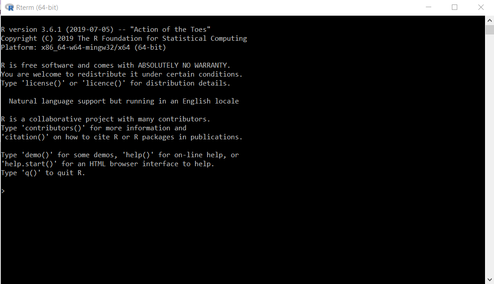

```{r setup, echo=FALSE, cache=FALSE}
library(knitr)
library(rmdformats)

## Global options
options(max.print="75")
opts_chunk$set(cache=TRUE,
               prompt=FALSE,
               tidy=TRUE,
               comment=NA,
               message=FALSE,
               warning=FALSE)
opts_knit$set(width=75)
```

# `R` ve `RStudio`

## `R` Programlama Dili Hakkında

S dilinden türetilen ve daha sonrasında S Plus kullanıcılarının geçişini kolaylaştırmasında aktif rol oynayan R dili, ilk olarak 1993 yılında piyasaya duyurulmuştur. 1995 yılında R’nin kaynak kodunu bir özgür yazılım lisansı altında kullanılabilir hale getirildi(yani insanlar onu istedikleri gibi kullanabilir, değiştirebilir ve dağıtabilirler). Dil geliştikçe daha fazla kullanıcı katıldı ve bu hataların gizlenmesi için daha az yer anlamına geliyordu.1997 yılının ortalarında Ihaka, Gentleman, Mächler, Peter Dalgaard, Kurt Hornik, Friedrich Leisch ve Thomas Lumley dahil 11 kişi R’nin kaynak kodunun anahtarlarına erişerek kendilerini **“R Core Team”** olarak adlandırdı. Yine o sene Viyana Ekonomi ve İşletme Üniversitesi’nden Hornik ve Leisch, kapsamlı R Arşiv Ağı’nı yani **CRAN**’ı oluşturarak R dilinin temel bilgilerini ve dosyalarını tek bir yerden indirmeye hazır hale getirilmesini sağladı.

2000 yılında, R projesinin kullanıma hazır olduğunu düşündükleri ilk sürüm olan R sürüm 1.0.0'ı yayımlandı. Ertesi yıl, birkaç alanında sözü geçen istatistikçi veri bilimi üzerine makaleler yayınladı ve 2003 yılında bu büyüyen alana adanmış ilk akademik dergi çıkarıldı. Şu anda veri bilimcisi olarak tanımlanan insanlar için, R, CRAN ve daha geniş diğer topluluklar, kendilerini istatistiksel araçlar ve tekniklerle keşfetme olanağı sundu.

İlerleyen zamanlarda bu veri bilimcileri, R dilinin ekoloji, dil bilimi, biyoinformatik ve ağ bilimi gibi çeşitli alanlardan önemli veri türlerini ve modellerini yönetmesine yardımcı olmak amacıyla CRAN’a paketler ekledi. Yavaş yavaş R bilgisi, veri bilimi alanlarında ve faaliyetlerinde çalışmak için bir ön koşul haline geldi. Bugünlerde ise R dili sektörde bir veri bilimcinin sahip olması gereken nitelikleri arasında yer almaktadır.

## Kurulum

R kurulumu için R programının farklı dağıtımları tercih edilebilir: 

- En çok tercih edilen R'ın tüm sürümlerinin bulunabileceği [R Arşiv Ağı(CRAN)](https://www.r-project.org/)'dan.
- Bir diğer dağıtım ise Microsoft tarafından açık olarak dağıtılandır. [Microsoft R Uygulama Ağı](https://mran.microsoft.com/)'dan indirilip kurulabilir.

Bir kez R kurulumu yapıldıktan sonra `R` programı başlatıldığında aşağıdaki gibi bir konsol açılacaktır:



Bu konsoldan `R` programlama dilinin sağladığı hemen her olanaktan yararlanılabilir. Örneğin hesaplama yapma, fonksiyon yazma ve çalıştırma gibi. 

Bir **Entegre Geliştirme Ortamı (Integrated Development Environment-IDE)**, düzenleyici ve derleyici gibi araçları kullanarak diğer programları yazmak için kullanılan bir yazılım ortamıdır. Bu, kodlamada birçok nedenden ötürü çeşitli diller kullandığında son derece yararlı bir araç olabilir. `R` programlama dili için günümüzde en popüler olan IDE ise `RStudio`'dur. Ücretsiz ve ücretli versiyonları bulunan `Rstudio` ise [buradan](https://rstudio.com/) indirilip kurulabilir.

Gerekli kurulum işlemleri yapıldıktan sonra `RStudio` görünümü ise aşağıdaki gibi olacaktır:


`RStudio` ile ilgili hızlı bilgiye [RStudio çalışma kağıdından](https://github.com/rstudio/cheatsheets/raw/master/rstudio-ide.pdf) ulaşılabilir.

# R Programlamanın Temelleri

## Değişken Atama

İfadeler, `R` komut satırına yazılır. `Rstudio` ile çalışırken ayrıca bir betik açılıp ifadeler buraya yazılıp çalıştırıldığında konsolda ifadenin kendisi ve çıktısı görülecektir. `R` da değişken atama operatörü `<-` ifadesidir:

```{r, echo=TRUE}
x <- 1
print(x)

x

mesaj <- "merhaba"

print(mesaj)
```

Komut istemine tam bir ifade girildiğinde değerlendirilir ve değerlendirilen ifadenin sonucu döndürülür. Sonuç otomatik olarak yazdırılabilir.

```{r, echo=TRUE}
# hiçbirşey yazdırılmaz
x <- 5

# otomatik yazdırma
x      

# açık yazdırma
print(x)
```

Çıktıda gösterilen `[1]`, `x`'in bir vektör ve `5`'in ilk elemanı olduğunu belirtir.

Burada `#` karakteri yorumu belirtir. `#` işaretinin sağındaki her şey (`#` kendisi dahil) yok sayılır. Bu, `R`'deki tek yorum karakteridir. Diğer bazı dillerin aksine, `R`, çok satırlı yorumları veya yorum bloklarını desteklemez.

Genellikle etkileşimli çalışmalarda, nesneleri `print` işlevi ile açıkça yazdırmayız; nesnenin adını yazıp return / enter tuşuna basarak bunları otomatik olarak yazdırmak çok daha kolaydır. Bununla birlikte, komut dosyaları, işlevler veya daha uzun programlar yazarken, bazen nesneleri açıkça yazdırmaya ihtiyaç duyulur çünkü otomatik yazdırma bu ayarlarda çalışmaz.

Bir R vektörü yazdırıldığında, vektör için dizinin yan taraftaki köşeli parantezler `[] ` içinde yazdırıldığını fark edeceksiniz. Örneğin, 20 uzunluğundaki bu tamsayı dizisine bakın.

```{r, echo=TRUE}
x <- 11:30
x
```

Köşeli parantez içindeki sayılar vektörün kendisinin bir parçası değildir, yalnızca yazdırılan çıktının bir parçasıdır.

`:` operatörü, tamsayı dizileri oluşturmak için kullanılır.

## R Nesneleri

`R` programlama dili, beş temel veya "atomik" nesne sınıfına sahiptir:

* karakter (charater)
* sayısal(gerçek sayılar) ifadeler (numeric)
* tamsayı (integer)
* karmaşık sayı (complex)
* mantıksal (Doğru / Yanlış) (logical)

En temel R nesnesi türü vektördür. `vector()` fonksiyonu ile boş vektörler oluşturulabilir. R'deki vektörlerle ilgili gerçekte tek bir kural vardır, o da, **bir vektörün yalnızca aynı sınıftaki nesneleri içerebileceğidir**.

Ancak elbette, herhangi bir iyi kural gibi, burada da bir istisna vardır, listeler yani `list`. Liste bir vektör olarak temsil edilir, ancak farklı sınıflardan nesneler içerebilir. Aslında, genellikle bu yüzden çok kullanıyoruz.

### Sayısal İfadeler

Ondalık değerler R'de sayısal ifade olarak adlandırılır. Varsayılan hesaplama veri türüdür. Bir `x` değişkenine aşağıdaki gibi ondalık bir değer atarsak, `x` sayısal tipte olacaktır.


```{r, echo=TRUE}
# ondalıklı sayı atama
x <- 10.5
# x değişkeninin değerini yazdırma
x
# x değişkenin türünü yazdırma
class(x)
```

Ayrıca, `k` değişkenine bir tamsayı atasak bile, sayısal bir değer olarak kaydedilmektedir.

```{r, echo=TRUE}
# ondalıklı sayı atama
k <- 1
# x değişkeninin değerini yazdırma
k
# x değişkenin türünü yazdırma
class(k)
```

`k`'nin bir tamsayı olmaması, `is.integer` işlevi ile doğrulanabilir. Tamsayı türü üzerine bir sonraki altbölümde nasıl tamsayı oluşturulacağını tartışacağız.

```{r, echo=TRUE}
# k bir tamsayı mıdır?
is.integer(k)
```

### Tamsayı İfadeler

R'de bir **tamsayı** değişkeni yaratmak için tamsayı fonksiyonunu çağırmamız gerekiyor. `is.integer` fonksiyonunu uygulayarak `y`'nin gerçekten bir tamsayı olduğundan emin olabiliriz.

```{r, echo=TRUE}
y <- as.integer(3)
# y değişkeninin değerini yazdırma
y
# y değişkeninin türünü yazdırma
class(y)
# y bir tamsayı mıdır?
is.integer(y)
```

Ayrıca sayının sonuna `L` son eki ekleyerek bir tamsayı tanımlayabiliriz.

```{r, echo=TRUE}
y <- 3L
# y bir tamsayı mıdır?
is.integer(y)
```

Bu arada, sayısal bir değeri `as.integer` fonksiyonu ile tamsayı olmaya zorlayabiliriz.

```{r, echo=TRUE}
# sayısal değerin zorlanması
as.integer(3.14)
```

Ve ondalık değerler için bir dizgeyi aynı şekilde ayrıştırabiliriz.

```{r, echo=TRUE}
# ondalık dizinin zorlanması
as.integer("5.27")
```

Öte yandan, ondalık olmayan bir dizgeyi ayrıştırmaya çalışmak da hatalıdır.

```{r, echo=TRUE}
# ondalık olmayan dizinin zorlanması
as.integer("Joe")
```

Genellikle, **mantıksal değerler** üzerinde aritmetik işlemler yapmak yararlıdır. Tıpkı `C` dili gibi R'de de, DOĞRU 1 değerine, YANLIŞ ise 0 değerine sahiptir.

```{r, echo=TRUE}
# DOĞRU'nun sayısal değeri
as.integer(TRUE)
# YANLIŞ'ın sayısal değeri
as.integer(FALSE)
```


### Kompleks Sayılar

R'de karmaşık bir sayı, saf sanal değer *i* aracılığıyla tanımlanır.


```{r, echo=TRUE}
# karmaşık bir sayı oluşturma
z <- 1+2i
# z değişkeninin değerini yazdırma
z
# z değişkeninin türü
class(z)
```

Aşağıdaki ifade, −1 karmaşık bir değer olmadığı için bir hata verir.

```{r, echo=TRUE}
# -1 in karekökü
sqrt(-1)
```

Bunun yerine kompleks sayı olan $-1+0i$ değişkenini yazmalıyız:

```{r, echo=TRUE}
# -1+0i nin karekökü
sqrt(-1+0i)
```

Bir diğer alternatif ise $-1$ sayısını kompleks bir değere zorlamaktır:

```{r, echo=TRUE}
# -1+0i nin karekökü
sqrt(as.complex(-1))
```


### Mantıksal İfadeler

**Mantıksal** bir değer, genellikle değişkenler arasında karşılaştırma yoluyla oluşturulur.

```{r, echo=TRUE}
# örnek değişkenler
x <- 1; y <- 2
# x, y'den büyük müdür?
z <- x > y
# mantıksal değerin yazdırılması
z
# z nin türünün yazdırılması
class(z)
```

Standart mantıksal işlemler ise `&`(ve), `|`(ya da) ve `!`(değil) şeklindedir.

```{r, echo=TRUE}
u <- TRUE; v<- FALSE
# u VE v
u&v
# u VEYA v
u|v
# u nun değili
!u
```


### Karakter

R'de dize değerlerini temsil etmek için **karakter** nesnesi kullanılır. Nesneleri `as.character()` işlevi ile karakter değerlerine dönüştürürüz:

```{r, echo=TRUE}
x <- as.character(3.14)
# karakter dizenin yazdırılması
x
# x in türünün yazdırılması
class(x)
```

İki karakter değişkeni `paste` işlevi ile birleştirilebilir.

```{r, echo=TRUE}
isim = "Cin"; soyisim = "Ali"
paste(isim, soyisim)
```

Bununla birlikte, C dili sözdizimine sahip olan `sprintf` işlevi ile okunabilir bir dizge oluşturmak genellikle daha uygundur.

```{r, echo=TRUE}
sprintf("%s isimli kişinin %d TL si var.", "Ayşe", 100)
```

Bir alt dizeyi çıkarmak için `substr` işlevini uygularız. Aşağıda, bir dizedeki üçüncü ve onikinci konumlar arasındaki alt dizenin nasıl çıkarılacağını gösteren bir örnek verilmiştir.


```{r, echo=TRUE}
substr("Alaattin'in sihirli bir lambasi var.", start=3, stop=12)
```

Ve dizede *"lambasi"* kelimesinin ilk geçtiği yeri başka bir *"kalemi"* kelimesiyle değiştirmek için `sub` işlevi uygularız.

```{r, echo=TRUE}
sub("lambasi", "kalemi", "Alaattin'in sihirli bir lambasi var.")
```


## Vektörler

**Vektör**, aynı temel türdeki veri öğeleri dizisidir. Bir vektördeki üyelere genel olarak olarak **bileşenler** denir. 

Aşağıda 2, 3 ve 5 olmak üzere üç sayısal değer içeren bir vektör tanımlanmıştır.

```{r, echo=TRUE}
c(2, 3, 5)
```

Mantıksal ifadelerden oluşan bir başka vektör:

```{r, echo=TRUE}
 c(TRUE, FALSE, TRUE, FALSE, FALSE)
```

Vektör, karakter dizgelerini de içerebilir:

```{r, echo=TRUE}
c("aa", "bb", "cc", "dd", "ee")
```

Vektörde içerilen elemanların sayısına `length` işlevi ile ulaşılır:

```{r, echo=TRUE}
length(c("aa", "bb", "cc", "dd", "ee"))
```


### Vektörlerin Birleştirilmesi

Vektörler `c` fonksiyonu ile birleştirilebilir. Aşağıdaki iki vektör `n` ve `s` örnekleri için, her iki vektörden öğeler içeren yeni bir vektörde birleştirilir.

```{r, echo=TRUE}
n = c(2, 3, 5) 
s = c("aa", "bb", "cc", "dd", "ee") 
c(n, s)
```

Yukarıdaki kod parçacığında, iki vektör birleştirildiğinde sayısal değerlerin karakter dizelerine nasıl zorlandığına dikkat edin. Bu, aynı vektördeki üyeler için aynı ilkel veri türünü korumak için gereklidir.


### Vektörlele İşlemler

Vektörlerin aritmetik işlemleri, üye bazında yani üye bazında gerçekleştirilir.

Örneğin, `a` ve `b` gibi iki vektörümüz olduğunu varsayalım.

```{r, echo=TRUE}
a = c(1, 3, 5, 7) 
b = c(1, 2, 4, 8)
```

Daha sonra, `a`'yı 5 ile çarparsak, her bir üyesinin 5 ile çarpıldığı bir vektör elde ederiz.

```{r, echo=TRUE}
5*a
```

Ve a ve b'yi birbirine eklersek, toplam, üyeleri a ve b'den karşılık gelen üyelerin toplamı olan bir vektör olur.

```{r, echo=TRUE}
a+b
```

Benzer şekilde çıkarma, çarpma ve bölme için de üye işlemlerle yeni vektörler elde ederiz.

```{r, echo=TRUE}
a - b 
a * b 
a / b 
```

İki vektör eşit uzunlukta değilse, daha kısa olanı daha uzun vektöre uyması için **geri dönüştürülecektir(recyling rule)**. Örneğin, aşağıdaki vektörler u ve v farklı uzunluklara sahiptir ve bunların toplamı, daha kısa u vektörünün geri dönüşüm değerleriyle hesaplanır.

```{r, echo=TRUE}
u = c(10, 20, 30) 
v = c(1, 2, 3, 4, 5, 6, 7, 8, 9) 
u + v
```


### Vektör İndeksi

Tek bir köşeli parantez `"[]"` operatörü içinde bir indeks bildirerek vektördeki değerlere ulaşabiliriz.

Örneğin, aşağıda bir vektör üyesinin nasıl alınacağı gösterilmektedir. Vektör dizini 1 tabanlı olduğundan, üçüncü üyeyi almak için dizin konumu 3'ü kullanırız.

```{r, echo=TRUE}
s = c("aa", "bb", "cc", "dd", "ee") 
s[3]
```

Diğer programlama dillerinin aksine, köşeli parantez operatörü tek tek üyelerden daha fazlasını döndürür. Aslında, köşeli parantez operatörünün sonucu başka bir vektördür ve `s[3]`, tek bir üye `"cc"` içeren bir vektör **dilimidir(slice)**.

İndeks negatifse, pozisyonu negatif indeks ile aynı mutlak değere sahip üyeyi çıkarır. Örneğin, aşağıdaki, üçüncü üyenin kaldırıldığı bir vektör dilimi oluşturur.

```{r, echo=TRUE}
s[-3]
```

Bir indeks vektör uzunluğunun dışındaysa, eksik bir değer olan `NA` sembolü ile bildirilecektir.

```{r, echo=TRUE}
s[10]
```


### Sayısal İndeks Vektörü

Verilmiş bir orijinal vektörün üye konumlarından oluşan **sayısal bir indeks vektörü** ile belirli bir vektörden Yeni bir vektör dilimlenebilir.

Burada, verilen bir vektörün ikinci ve üçüncü üyelerini içeren bir vektör diliminin nasıl alınacağını gösterir.

```{r, echo=TRUE}
s = c("aa", "bb", "cc", "dd", "ee") 
s[c(2, 3)]
```

İndeks vektörü, yinelenen değerlere izin verir. Dolayısıyla, aşağıdaki işlem bir işlemde bir üyeyi iki kez alır.

```{r, echo=TRUE}
s[c(2, 3, 3)]
```

İndeks vektörü bozuk bile olabilir. Burada, birinci ve ikinci üyelerin sırası tersine çevrilmiş bir vektör dilimi örneklenmiştir.

```{r, echo=TRUE}
s[c(2, 1, 3)]
```

İki dizin arasında bir vektör dilimi oluşturmak için iki nokta operatörünü `":"` kullanabiliriz. Bu, büyük vektörleri içeren durumlar için uygun olabilir.

```{r, echo=TRUE}
s[2:4]
```


### Mantıksal İndeks Vektörü

Verilmil bir orijinal vektör ile aynı uzunluğa sahip **mantıksal bir indeks vektörü** ile yeni bir vektör  dilimlenebilir. Orijinal vektördeki karşılık gelen üyeler dilime dahil edilecekse üyeleri DOĞRU, aksi takdirde YANLIŞ olur.

Örneğin, aşağıdaki 5 uzunluğundaki s vektörlerini düşünün.

```{r, echo=TRUE}
s = c("aa", "bb", "cc", "dd", "ee") 
s[c(2, 3)]
```

`s`'nin ikinci ve dördüncü üyelerini elde etmek için, aynı uzunlukta bir `L` mantıksal vektörünü tanımlalım ve ikinci ve dördüncü üyeleri `TRUE` olarak ayarlalım.

```{r, echo=TRUE}
s = c("aa", "bb", "cc", "dd", "ee") 
s[c(2, 3)]
```

```{r, echo=TRUE}
L = c(FALSE, TRUE, FALSE, TRUE, FALSE) 
s[L]
```

Kod, tek bir satır olarak kısaltılabilir.

```{r, echo=TRUE}
s[c(FALSE, TRUE, FALSE, TRUE, FALSE)]
```


### İsimlendirilmiş Vektör Üyeleri

Vektör üyelerine isimler atayabiliriz.

Örneğin, aşağıdaki v değişkeni iki üyeli bir karakter dizgisi vektörüdür.

```{r, echo=TRUE}
v = c("Cin", "Ali") 
v
```

Şimdi ilk üyeyi `birinci` ve ikinciyi `ikinci` olarak adlandıralım.

```{r, echo=TRUE}
names(v) = c("birinci", "ikinci") 
v 
```

Daha sonra ilk üyeyi ismine göre alabiliriz.

```{r, echo=TRUE}
v["birinci"] 
```

Ayrıca, sıralamayı bir karakter dizisi indeks vektörü ile tersine de çevirebiliriz.

```{r, echo=TRUE}
v[c("ikinci", "birinci")]
```


## Matrisler

**Matris**, iki boyutlu dikdörtgen bir düzende düzenlenmiş bir veri öğeleri kümesidir. Aşağıda 2 satırlı ve 3 sütunlu bir matris örneği verilmiştir.

Matris fonksiyonu ile R'deki matrisin hafıza gösterimini yeniden oluşturuyoruz. Veri öğeleri aynı temel türde olmalıdır.

```{r, echo=TRUE}
A = matrix( 
    c(2, 4, 3, 1, 5, 7), # veri elemanları 
    nrow=2,              # satır sayısı 
    ncol=3,              # sütun sayıs 
    byrow = TRUE)        # matirsi satırlara göre doldurma

# matrisi yazdırma
A
```

m-inci satır, n-inci sütundaki bir elemana `A[m,n]` ifadesi ile ulaşılabilir:

```{r, echo=TRUE}
# 2 inci satır 3 üncü sütundaki elemanı yazdırma
A[2,3]
```

m-inci satırın tamamına `A[m, ]` ifadesi ile ulaşılabilir:

```{r, echo=TRUE}
# 2 inci satır 
A[2,]
```

n-inci sütunun tamamına `A[ ,n]` ifadesi ile ulaşılabilir:

```{r, echo=TRUE}
# 3 ünci sütun 
A[ ,3]
```

Aynı anda birden fazla satır ve sütuna erişilebilir:

```{r, echo=TRUE}
# 1 inci ve 3 ünci sütun 
A[ ,c(1,3)]
```

Matrisin satır ve sütunlarına isimler atarsak, elemanlara isimlerle erişebiliriz.

```{r, echo=TRUE}
dimnames(A) = list( 
    c("satir1", "satir2"),           # satır isimleri 
    c("sutun1", "sutun2", "sutun3")) # sütun isimleri 
# A matrisini yazdırma
A
# 2 inci satır 3 üncü sütundaki eleman
A["satir2", "sutun3"] 
```

### Matris Oluşturma

Matris oluşturmanın çeşitli yolları vardır. Doğrudan veri öğeleriyle bir matris oluşturduğumuzda, matris içeriği varsayılan olarak sütun yönlendirmesi boyunca doldurulur. Örneğin, aşağıdaki kod parçacığında, B'nin içeriği sütunlar boyunca art arda doldurulur.

```{r, echo=TRUE}
B = matrix( 
    c(2, 4, 3, 1, 5, 7), 
    nrow=3, 
    ncol=2) 
# B matrisinde 3 satır ve 2 sütun olur 
B  
```

Bir matrisin sıralarını ve sütunlarını `t` fonksiyonu ile değiştirerek `devrik matrisi(transpose)` oluşturabiliriz.

```{r, echo=TRUE}
# B matrisinin devriği 
t(B)  
```

Aynı sayıda satıra sahip iki matrisin sütunları, daha büyük bir matriste birleştirilebilir. Örneğin, 3 satırlı başka bir C matrisimiz olduğunu varsayalım.

```{r, echo=TRUE}
C = matrix( 
    c(7, 4, 2), 
    nrow=3, 
    ncol=1) 
# C matrisinde 3 satır bulunur 
C             
```

Sonra B ve C'nin sütunlarını `cbind` işlevi ile birleştirebiliriz.

```{r, echo=TRUE}
cbind(B, C)
```

Benzer şekilde, iki matrisin satırlarını `rbind` fonksiyonu ile aynı sayıda sütuna sahiplerse birleştirebiliriz.

```{r, echo=TRUE}
D = matrix( 
    c(6, 2), 
    nrow=1, 
    ncol=2) 
# D marisinde 2 sütun olur 
D         
rbind(B, D) 
```

Tüm sütun vektörlerini tek bir yerde birleştiren `c` işlevini uygulayarak bir matrisi çözebiliriz.

```{r, echo=TRUE}
c(B)
```


## Listeler

**Liste**, diğer nesneleri içeren genel bir vektördür.

Örneğin, aşağıdaki `x` değişkeni, `n`, `s`, `b` gibi üç vektörünün kopyalarını ve bir sayısal değer 3'ü içeren bir listedir.

```{r, echo=TRUE}
n <- c(2, 3, 5) 
s <- c("aa", "bb", "cc", "dd", "ee") 
b <- c(TRUE, FALSE, TRUE, FALSE, FALSE) 
# x listesi n, s ve b nin birer kopyasını içerir
x <- list(n, s, b, 3)   
```

Tek köşeli parantez `"[]"` operatörüyle listenin bir dilimini alabiliriz. Aşağıdaki örnek, s'nin bir kopyasının olduğu x'in ikinci üyesini içeren bir dilimdir.

```{r, echo=TRUE}
x[2] 
```

Bir indeks vektörü ile birden fazla üyeli bir dilim de alabiliriz. Burada x'in ikinci ve dördüncü üyelerini içeren bir dilim örneklenmiştir.

```{r, echo=TRUE}
x[c(2,4)] 
```

Bir liste üyesine doğrudan başvurmak için, çift köşeli parantez `"[[]]"` operatörünü kullanmamız gerekir. Aşağıdaki `x[[2]]` nesnesi, `x`'in ikinci üyesidir. Başka bir deyişle, `x[[2]]`, `s`'nin bir kopyasıdır, ancak `s` veya kopyasını içeren bir dilim değildir.

```{r, echo=TRUE}
x[[2]]
```

İçeriğini doğrudan değiştirebiliriz.

```{r, echo=TRUE}
x[[2]][1] = "ta" 
x[[2]]
# s bu değişiklikten etkilenmez
s
```

### İsimlendirilmiş Liste Üyeleri

Liste üyelerine isimler atayabilir ve onlara sayısal dizinler yerine isimlerle başvurabiliriz.

Örneğin, aşağıdaki `v` listesi, `"kelebek"` ve `"civciv"` adlı iki üyeden oluşan bir listedir.

```{r, echo=TRUE}
v = list(kelebek=c(2, 3, 5), civciv=c("aa", "bb")) 
v 
```

Tek köşeli parantez `"[]"` operatörüyle listenin dilimini alabiliriz. Aşağıdaki örnekte, `"kelebek"` adlı bir `v` üyesini içeren liste dilimi vardır.

```{r, echo=TRUE}
v["kelebek"]
```

Bir indeks vektörü ile birden fazla üyeli bir dilim de alabiliriz. İşte `v`'nin her iki üyesinin de bulunduğu bir liste dilimi. Onların `v`'deki orijinal konumlarından nasıl tersine döndüklerine dikkat edin.

```{r, echo=TRUE}
v[c("civciv", "kelebek")] 
```

Bir liste üyesine doğrudan başvurmak için, çift köşeli parantez `"[[]]"` operatörünü kullanmamız gerekiyordu. Aşağıda bir `v` üyesine adıyla atıfta bulunulmaktadır.

```{r, echo=TRUE}
v[["kelebek"]]
```

İsimlendirilmiş bir liste üyesine, çift köşeli parantez operatörü yerine doğrudan `"$"` operatörü ile de başvurulabilir.

```{r, echo=TRUE}
v$kelebek
```

R arama yoluna bir liste **ekleyebilir(`attach`)** ve listeden açıkça bahsetmeden üyelerine erişebiliriz. Temizlemek için de aynı listenin **çıkarılması(`detach`)** gerekir.

```{r, echo=TRUE}
attach(v) 
kelebek 
detach(v)
```


## Veri Çerçeveleri

Veri tablolarını depolamak için veri çerçevesi(`dataframe`) kullanılır. Veri çerçevesi, eşit uzunluktaki vektörlerin bir listesidir. Örneğin, aşağıdaki `df` değişkeni, üç vektör `n`, `s` ve `b` içeren bir veri çerçevesidir.

```{r, echo=TRUE}
n = c(2, 3, 5) 
s = c("aa", "bb", "cc") 
b = c(TRUE, FALSE, TRUE)
# df, bir veri çerçevesidir
df = data.frame(n, s, b)       
```

Eğitimler için genellikle R'de **yerleşik(built-in)** veri çerçeveleri kullanırız. Örneğin, burada R'de `mtcars` adı verilen yerleşik bir veri çerçevesi gösterilmiştir.

```{r, echo=TRUE}
mtcars
```

**Başlık(header)** olarak adlandırılan tablonun en üst satırı sütun adlarını içerir. Her yatay çizgi satırın adıyla başlayan ve ardından gerçek verilerle devam eden bir **veri satırını(data row)** belirtir. Bir satırın her veri üyesine **hücre(cell)** adı verilir.

Bir hücredeki verileri almak için, satır ve sütun koordinatlarını tek köşeli parantez `"[]"` operatörüne gireriz. İki koordinat virgülle ayrılır. Başka bir deyişle, koordinatlar satır konumuyla başlar, ardından virgülle başlar ve sütun konumu ile biter. Sıra önemlidir.

İşte `mtcars`'ın ilk satırındaki ikinci sütunundaki hücre değeri.

```{r, echo=TRUE}
mtcars[1, 2]
```

Ayrıca sayısal koordinatlar yerine satır ve sütun adlarını da kullanabiliriz.

```{r, echo=TRUE}
mtcars["Mazda RX4", "cyl"]
```

Son olarak, veri çerçevesindeki veri satırlarının sayısı `nrow` fonksiyonu ile bulunur.

```{r, echo=TRUE}
# veri satırı sayısı
nrow(mtcars)    
```

Ve bir veri çerçevesinin sütun sayısı `ncol` fonksiyonu tarafından verilir.

```{r, echo=TRUE}
# veri sütunu sayısı
ncol(mtcars)    
```

Tüm veri çerçevesini yazdırmak yerine, genellikle önceden `head` işlevi ile ön izlemesini yapılabilir.

```{r, echo=TRUE}
head(mtcars)
```

### Veri Çerçevesi Sütun Vektörü

Çift köşeli parantez `"[[]]"` operatörüyle veri çerçevesi sütununa başvurabiliriz.

Örneğin, yerleşik veri seti `mtcars`'ın dokuzuncu sütun vektörünü elde etmek için `mtcars[[9]]` yazarız.

```{r, echo=TRUE}
mtcars[[9]]
```

Aynı sütun vektörüne ismiyle de ulaşılabilir.

```{r, echo=TRUE}
mtcars[["am"]]
```

Çift köşeli parantez operatörü yerine "$" operatörü ile de aynı işlemi gerçekleştirebiliriz.

```{r, echo=TRUE}
mtcars$am
```

Aynı sütun vektörünü almanın bir başka yolu da tek köşeli parantez `"[]"` operatörünü kullanmaktır. Sütun adının başına, satır konumu için bir joker karakter eşleşmesini işaret eden bir virgül karakteri ekleriz.

```{r, echo=TRUE}
mtcars[,"am"]
```

### Veri Çerçevesi Sütun Dilimi

Tek köşeli parantez `"[]"` operatörüyle veri çerçevesi sütun dilimi alabiliriz.

Aşağıdaki örnek, yerleşik veri seti mtcars'ın ilk sütununu içeren bir dilimdir.

```{r, echo=TRUE}
mtcars[1]
```

Aynı sütun dilimini ismine göre de alabiliriz.

```{r, echo=TRUE}
mtcars["mpg"]
```

İki sütun `mpg` ve `hp` ile bir veri çerçevesi dilimi almak için, sütun adlarını tek köşeli ayraç operatörünün içindeki bir dizin vektöründe paketleriz.

```{r, echo=TRUE}
mtcars[c("mpg", "hp")]
```

### Veri Çerçevesi Satır Dilimi

Sütunlarda yaptığımız gibi, tek köşeli parantez operatörüyleveri çerçevesinden satırları alabiliriz. Ancak, satır konumlarının bir dizin vektörüne ek olarak, fazladan bir virgül karakteri ekleriz. Ekstra virgül, sütun konumları için ikinci koordinat için bir joker karakter eşleşmesini işaret ettiği için bu önemlidir.

Örneğin, aşağıda yerleşik veri seti `mtcars`'ın bir satır kaydı alınmıştır. Lütfen köşeli parantez operatöründe fazladan virgül olduğuna dikkat edin ve bu bir yazım hatası değildir. 1974 Camaro Z28'in galon başına 13.3 mil gaz kilometreye ve sekiz silindirli 245 beygir gücünde bir motora sahip olduğunu belirtir.

```{r, echo=TRUE}
mtcars[24,]
```

Birden fazla satırı almak için sayısal bir indeks vektörü kullanırız.

```{r, echo=TRUE}
mtcars[c(3, 24),]
```

Satırı adına göre de alabiliriz.

```{r, echo=TRUE}
mtcars["Camaro Z28",]
```

Ve birden çok satırı elde etmek için satır adlarını bir indeks vektöründe paketleyebiliriz.

```{r, echo=TRUE}
mtcars[c("Datsun 710", "Camaro Z28"),]
```

Son olarak, mantıksal bir indeks vektörü ile de satırları alabiliriz. Aşağıdaki L vektöründe, aracın otomatik şanzımanı varsa üye değeri `TRUE`, aksi takdirde `FALSE`'dir.

```{r, echo=TRUE}
L = mtcars$am == 0 
L 
```

İşte otomatik şanzımanlı araçların listesi.

```{r, echo=TRUE}
mtcars[L,]
```

Ve işte otomatik şanzıman için gaz kilometre verileri.

```{r, echo=TRUE}
mtcars[L,]$mpg
```

### Verilerin Okunması

Excel dosyasından verilerin okunması:

* `read.xls` (`gdata` kütüphanesi)
* `loadWorkbook` (`XLConnect` kütüphanesi)

Minitab uzantılı verilerin okunması:

* `read.mtp` (`foreign` kütüphanesi)

SPSS uzantılı verilerin okunması:

* `read.spss` (`foreign` kütüphanesi)

txt uzantılı verilerin okunması:

* `read.table` 

csv uzantılı verilerin okunması:

* `read.csv`

# Birkaç Yararlı `R` Komutu

* `ls()`          : çalışma alanındaki dosyaların listesi
* `rm(x)`         : çalışma alanından x nesnesini kaldırır
* `rm(list=ls())` : çalışma alanından tüm nesneleri kaldırır
* `setwd`         : çalışma alanını ilgili dizine belirler
* `getwd`         : çalışma alanının bulunduğu dizini gösterir


